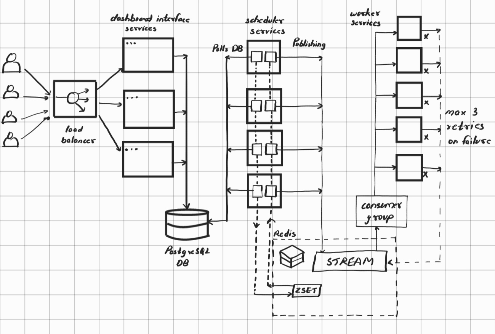
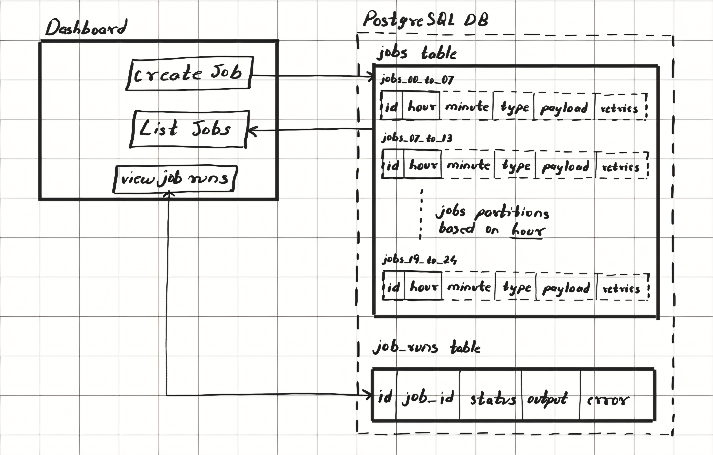
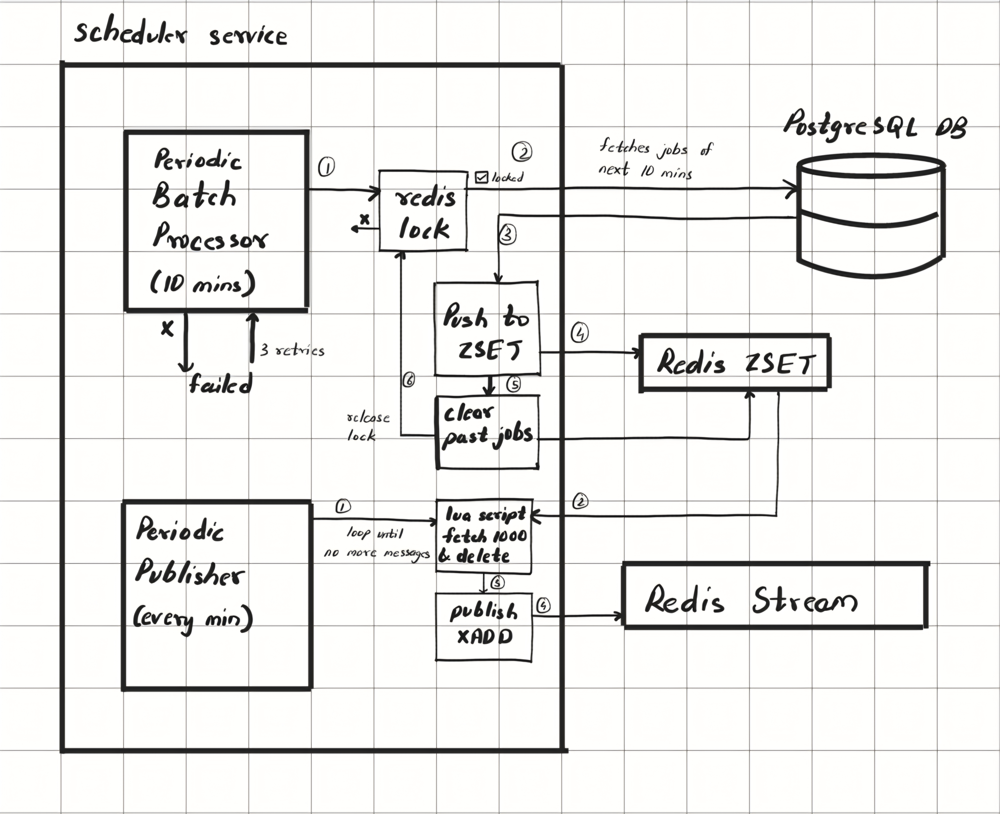
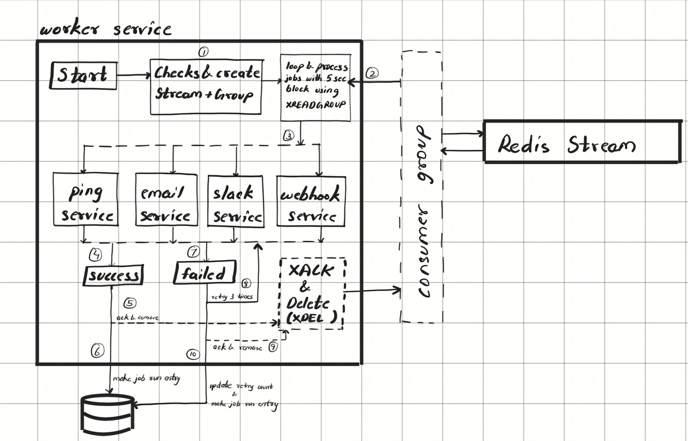

# Distributed Task Scheduler

This is a distributed task scheduler service.
It contains dashboard service, scheduler service and worker service designed for processing massive workload.

## Architecture

This system consists of following components:

1. `Dashboard`: The dashboard lets users create a new job, list all jobs and view job run entries with their status (completed, failed, permanently_failed). The dashboard interface services are served with a load balancer. On creation of a new job, an entry is made in the `jobs` table.
2. `Scheduler`: The scheduler service has two sub-service - Batch processor and Publisher. The Batch Processor polls the PostgreSQL DB every 10 mins with a Redis lock to query jobs for next 10 min range. After getting the jobs, it adds them to Redis’s sorted set (ZSET).
   The Publisher runs every minute to fetch all jobs from ZSET for current time. It then publishes these jobs to Redis stream.
3. `Worker`: The worker services are part of a consumer group which gets jobs from the Redis stream and process them further. On success, it makes entry in the `job_runs` table as completed. On failure, it puts back the jobs to the stream for further retrying. On retrying for max 3 times, it marks the job as permanently failed and creates entry in the `job_runs` table.
4. `PostgreSQL DB`: PostgreSQL is used to store the job details in `jobs` table which is partitioned using the hour time of jobs. e.g a partition for storing jobs whose scheduled hour is 00 to 06, another for 07 to 12, etc. It stores the hour, minute, payload and retry count.
   It has another table `job_runs` to store the job run entries with their statuses (completed, failed, permanently_failed). It also stores the output (for completed runs) and error (for failed runs).
5. `Redis`: Redis is used for letting the Batch Processor of scheduler service to create a lock so that only one instance polls the DB.
   Redis’s sorted set is used to store jobs with their timestamp as scores for fast access during every minute polling of the Publisher of scheduler service.
   Redis Stream is used to queue the jobs.

As this is a time sensitive system, storing and processing of jobs are done at their UTC times across all services and DB.

## Dashboard

The dashboard lets users create a new job, list all of the jobs and view run entries of a job.

1. `Creating & Viewing jobs`: When a job is created from dashboard interface, the timezone of the client is also passed with the request. The schedule time is then converted to UTC and the job is inserted into `jobs` table. The `jobs` table has `id`, `hour` UTC converted, `minute` UTC converted, `type` (ping, email, slack, webhook), `payload`, `retries` count, `created_at` and `updated_at` times.
   The `jobs` table is partitioned using the `hour` column in different hour range partitions. e.g `jobs_00_to_06` for storing jobs whose UTC hour ranges between 00 and 06, `jobs_07_to_12` for storing jobs whose UTC hour ranges between 07 and 12, etc.
2. `Viewing job run entries`: Job run entries are viewed using the `job_runs` table which stores the `id`, `job_id`, `status` (completed, failed, permanently_failed), `output` for success runs, `error` for failed runs, `scheduled_at` and `completed_at` time.

## Scheduler

The Scheduler service has two main components: Batch Processor and Publisher:

`Batch Processor`:

1. It polls the PostgreSQL DB every 10 mins to read jobs from the `jobs` table.
2. For multiple scheduler service instances, it first tries to create a Redis lock so that only one scheduler instance polls the DB.
3. If the instance is unable to get the lock, it will exit and wait for next timer period.
   The batch processor fetches jobs of next 10 mins at every 10s rounded time i.e 12:00, 12:10, 12:20,… it fetches jobs of next 10 min range i.e at 12:10, it fetches jobs for 12:11 to 12:20 range, at 12:20, it fetches jobs for 12:21 to 12:30, etc.
4. On getting the Redis lock, jobs are queried. It pushes these jobs to the Redis’s sorted set (ZSET).
5. After pushing the jobs, it also clears all previous jobs if they were not processed in past 10 mins from ZSET. These lost jobs can be logged as lost/failed.

Here, ZSET is used because of its score mechanism. The jobs are stored in a sorted manner using their timestamps as score(sorting key). So, the insertion becomes O(log N) and fetching is O(log N + M).
In case of errors, the locked batch processor can run for maximum 3 times for retrying.

`Publisher`:

1. It runs for every minute to get jobs from the ZSET for that specific time.
2. All jobs of current time are fetched in batches via all of the scheduler instances until there are no jobs available in ZSET for that current time.
3. The jobs are fetched and deleted at same time using a single lua script which runs on the redis server end to avoid same jobs getting fetched from different instances.
4. Then it publishes all of the jobs to Redis stream using `XAdd`.

## Worker

The worker services are part of a consumer group listening over this stream. Using consumer groups, we can solve the problem of duplicate job execution, since the consumer group ensures that a single job message is delivered to only one consumer.

1. When a worker is started, it first check for the consumer group, and if it is not present, it creates it.
2. Then we get the job from the stream in a batch of N using `XREADGROUP`. On every read, we wait for 5 seconds until there are N jobs in the stream. As soon as N jobs becomes available in the stream it fetches them. After 5 seconds, if there are less than N jobs, it still fetches them.
3. These jobs are then processed based on their type which is present in their payload. For `ping` type, we make a GET call, for email type, we try to send an `email` using mailtrap.io service, for `slack` type, we make a POST call to given slack url and for `webhook` type, we make the POST call from given url and body.
4. If the job execution was success, we make an entry in the `job_runs` table with `completed` status and reset the `retries` count of that job to 0 in `jobs` table. Then that job message is acknowledged using `XAck` and deleted from the stream using `XDel`.
5. If the job execution fails, we first get the `retries` count of that job from `jobs` table. If the `retries` count is less than 3, we make an entry in `job_runs` table with `failed` status and increment the `retries` count of that job in `jobs` table. Then the job message is acknowledged and deleted from stream. Then a new entry of that job is published to the stream for further retries using `XAdd`.
6. If on failed job execution, we get the `retries` count >= 3, we make an entry in the `job_runs` table with `permanently_failed` status and reset the `retries` count to 0 for that job in `jobs` table. Then the job message is acknowledged and deleted from stream.

## Testing

For testing, I deployed the services using AWS ECS with Fargate.

#### Configurations:

- dashboard: 1 instance
- scheduler: 3 instances
- worker: 5 instances
- Fargate specs: 1 vCPU and 2GB Memory
- Postgres: Used RDS
- Redis: Installed on t2.medium EC2

#### Creating load:

For creating jobs, i used `generate_insert.py`, which generates job insert batches with provided UTC hour, minutes.

It also has parameters to generate N jobs for given heavy_minutes list.

I created jobs for a 10 min range, where each min can have 1000 to 5000 jobs and some minutes can have 10000 jobs.

The testing batch that i used had 60k+ jobs for a 10 min range.

#### Observation:

- The Batch processing from DB worked well with redis lock. Only one instance processed the batch and other exited properly due to no lock.
- The insertion of jobs into Redis sorted set was very quick. For highest 10k jobs, it only took some milliseconds.
- On worker end, consuming jobs from redis stream was slow i.e ~10k jobs/min(plus failed jobs requeued for retries). There is need to adjust the batch count from workers in the consumer group considering highest load.
- The slow worker processing can also be solved by increasing number of workers. Having more workers parallely can distribute the load.
